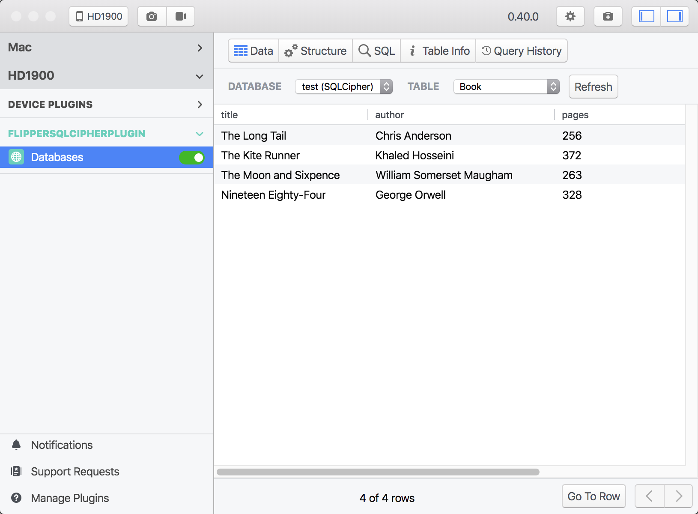

## preview


## How to use

Add the JitPack repository to your build file
```gradle
allprojects {
    repositories {
        ...
        maven { url 'https://jitpack.io' }
    }
}
```

Add the dependency

```gradle
dependencies {
    implementation 'com.github.yueban:flipper-sqlcipher-plugin:1.0.1'
}
```

Create a `SqlCipherDatabaseDriver` to init your `DatabasesFlipperPlugin`
```kotlin
val client = AndroidFlipperClient.getInstance(this)

// add database plugin
client.addPlugin(
    DatabasesFlipperPlugin(
        SqlCipherDatabaseDriver(this, object : DatabasePasswordProvider {
            override fun getDatabasePassword(databaseFile: File): String {
                return if ("your database file name" == databaseFile.name) {
                    return "your database password"
                } else {
                    ""
                }
            }
        })
    )
)

client.start()
```

check [sample](sample) for more details.
